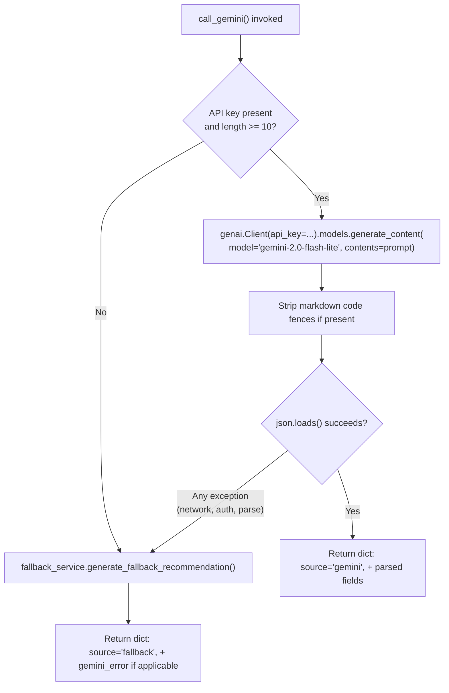

# AI Integration

## Overview

The platform does not train or host any ML model. All "AI" functionality is a prompt-engineered call to **Google's Gemini API** (`gemini-2.0-flash-lite`) via the official `google-genai` Python SDK, with a fully deterministic rule-based fallback that guarantees the app remains functional without any AI dependency.

## Where AI is used

| Feature | Endpoint(s) | Module |
|---|---|---|
| Settlement recommendation strategy + letter | `/api/v1/settlement/recommend`, `/api/settlement/predict` | `gemini_service.call_gemini()` |
| Negotiation letter generation | `/api/v1/ai/negotiation-letter`, `/api/negotiation/generate` | `gemini_service.call_gemini()` |

Both features funnel through the same `call_gemini()` function — the only difference between "settlement recommendation" and "negotiation letter" from the AI's perspective is which caller reads which fields out of the same returned dict, and whether `lender_name`/`borrower_name` are supplied.

## Financial Analysis Engine → AI handoff

The AI is never given raw loan numbers directly. Every call first passes through `financial_engine.run_financial_analysis()`, which derives:

- `debt_stress_level` (`LOW` / `MEDIUM` / `HIGH` / `CRITICAL`)
- `financial_health_score` (0–100)
- `emi_ratio`, `monthly_surplus`, `recommended_settlement_amount`, `settlement_percentage`

These derived values — not the raw loan amount/income — are what get embedded into the Gemini prompt. This is a sound design choice: it keeps the AI's job to "write persuasively about an already-computed situation" rather than "do financial math," which LLMs are unreliable at.

## Prompt design

Built in `gemini_service._build_prompt()`. Structure:

1. **Role framing**: "You are a professional financial advisor specializing in debt settlement and negotiation."
2. **Structured financial profile** injected as labeled key-value lines (stress level, health score, EMI ratio, surplus, balance, settlement amount/percentage, lender/borrower names).
3. **Explicit 4-part output spec**: `RECOMMENDATION_SUMMARY`, `NEGOTIATION_STRATEGY`, `NEGOTIATION_LETTER`, `FINANCIAL_TIPS` (exactly 3 tips).
4. **Strict output format instruction**: "Respond ONLY in this exact JSON format with no extra text," followed by a literal JSON template.

This is a reasonable single-shot structured-output prompt. It does **not** use Gemini's native structured-output / JSON-mode / function-calling features (available in the `google-genai` SDK via `response_mime_type` / response schemas) — it relies entirely on instruction-following plus manual string parsing, which is why the code has defensive markdown-fence-stripping logic before calling `json.loads()`.

## Response handling & fallback logic

Key resilience properties:
- **No retries** — a single failed call goes straight to fallback (no exponential backoff, no `tenacity` usage despite `tenacity` being in `requirements.txt`).
- **No streaming** — uses `generate_content()` (blocking, full-response), not the streaming API.
- **No caching** — every identical request re-calls Gemini; there's no memoization of prompts/responses.
- **Broad exception handling** — `except Exception as e` catches everything (network errors, auth errors, malformed JSON, rate limits) identically and routes all of them to fallback. This means transient Gemini outages are invisible to the end user (a strength for UX) but also invisible in monitoring (a weakness for operators — see [Security.md](Security.md) / [Future_Improvements.md](Future_Improvements.md)).

## Fallback ("rule-based AI") engine

`fallback_service.generate_fallback_recommendation()` produces a response with the **exact same shape** as a Gemini response (`recommendation_summary`, `negotiation_strategy`, `negotiation_letter`, `financial_tips`), so calling code never needs to branch on `source`.

- **Strategy/summary** is selected from 4 canned text blocks keyed by `debt_stress_level` (`CRITICAL`/`HIGH`/`MEDIUM`/`LOW`).
- **Letter** is an f-string template with the borrower's numbers interpolated (outstanding balance, monthly surplus, settlement amount/percentage, stress level). It does **not** interpolate the actual lender or borrower name into the salutation (unlike Gemini's version, which does) — it always ends with the literal placeholders `[Borrower Name]`, `[Contact Information]`, `[Date]`. **Inferred limitation**: a user relying on the fallback path gets a noticeably less-personalized letter than one using Gemini.
- **Tips** are assembled conditionally based on `emi_ratio`, `monthly_surplus`, and `stress_level` thresholds (e.g., "EMI exceeds 40% of income → suggest tenure extension").

## AI status endpoint

`GET /api/v1/ai/status` reports whether Gemini is configured (`gemini_active: bool(settings.GEMINI_API_KEY)`) — this only checks that a key **exists**, not that it is valid or that Gemini is currently reachable. A user could see `gemini_active: true` and still have every actual request silently fall back due to an invalid key or network failure.

## Cost / rate-limit considerations

Not present in the code at all: no token-usage tracking, no per-user rate limiting on AI calls, no cost estimation, no queuing. Every settlement/negotiation request costs one live Gemini call (when the key is valid). See [Future_Improvements.md](Future_Improvements.md) for recommendations.
