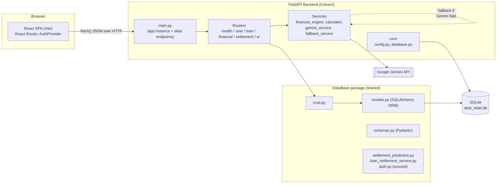
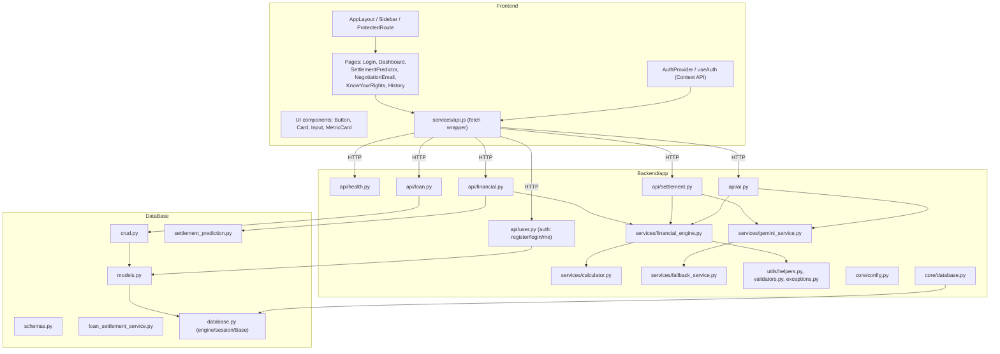
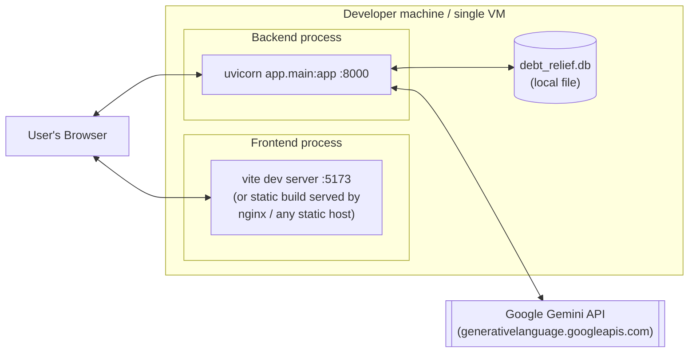

# Architecture

## 1. Style

The system is a classic **3-tier web application**:

- **Presentation tier** — React SPA (Vite build), talks to the backend exclusively over HTTP/JSON.
- **Application tier** — FastAPI backend, split into routers → services → utils, plus a "Database" package that is treated as a semi-external shared library.
- **Data tier** — SQLite file (`debt_relief.db`), accessed through SQLAlchemy ORM models.

There is no message queue, no caching layer, and no microservices — it is a single deployable backend process and a single static-asset frontend build.

## 2. High-Level Architecture Diagram

## 3. Why this structure

- **Router → Service → Utils layering (backend)**: each FastAPI router module (`app/api/*.py`) is a thin HTTP adapter. Business logic (EMI math, health scoring, AI prompt construction) lives in `app/services/*.py`, and small stateless helpers live in `app/utils/*.py`. This is a reasonable, standard FastAPI layering choice.
- **Shared `DataBase/` package**: models, Pydantic schemas, and CRUD functions live in a top-level `DataBase/` folder rather than inside `Backend/app/`, and the backend adds that folder to `sys.path` at runtime (see `Backend/app/core/database.py` and nearly every router file). **Inferred**: this reflects a team split where one member ("Khushi", per code comments) owned the database layer independently of the FastAPI backend, and the two were integrated via `sys.path` manipulation rather than a proper installable package or shared library. This works but is fragile — see [Future_Improvements.md](Future_Improvements.md).
- **AI service with fallback**: `gemini_service.call_gemini()` always returns a valid recommendation dict, either from Gemini or from `fallback_service.generate_fallback_recommendation()`. This guarantees the two AI-dependent endpoints (`/settlement/recommend`, `/ai/negotiation-letter`) never hard-fail due to AI unavailability — a deliberate resilience pattern.
- **Compatibility alias layer in `main.py`**: a large block of duplicate endpoints exists purely to match a specific frontend implementation's expected URL paths and JSON field names (see [Troubleshooting.md](Troubleshooting.md)). This is not a designed architectural layer — it is an integration patch.

## 4. Component Diagram

## 5. Deployment Diagram

There is no containerization, orchestration, or IaC in the repository — deployment today is manual process-per-machine. See [Deployment.md](Deployment.md) for recommended productionization steps.
