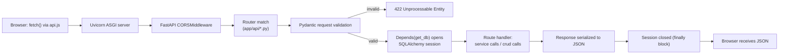
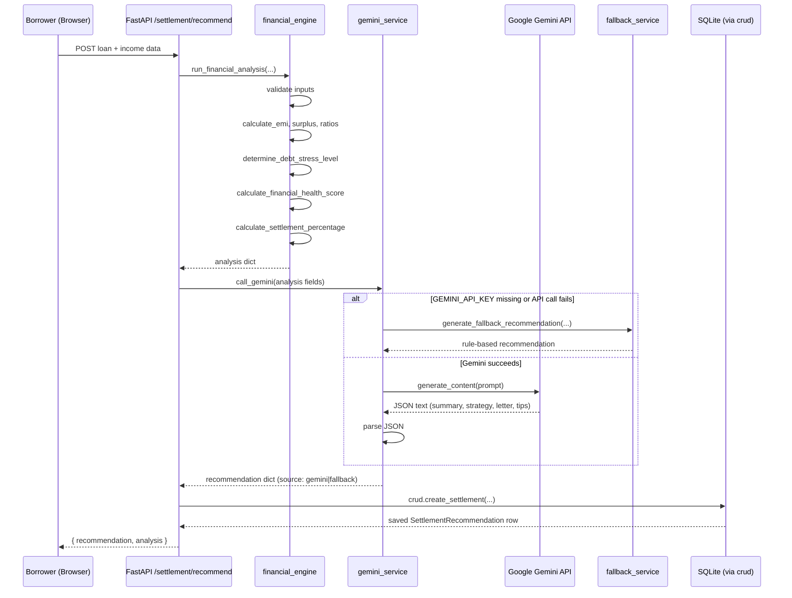
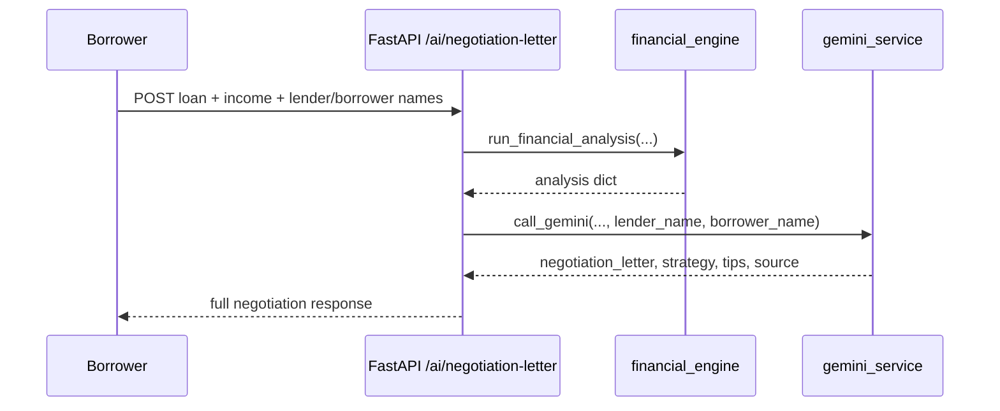
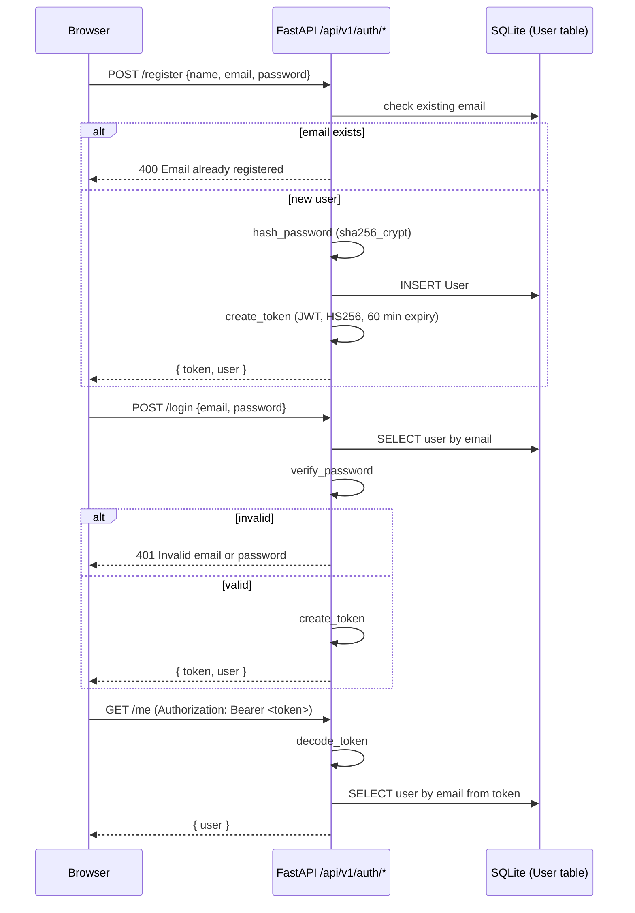
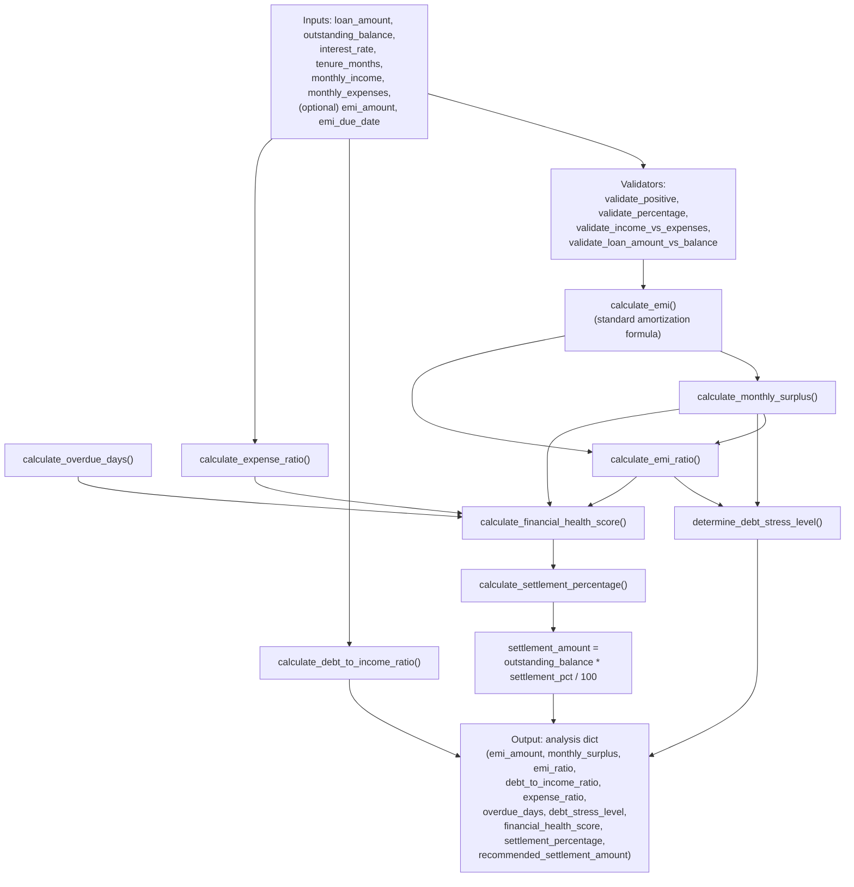
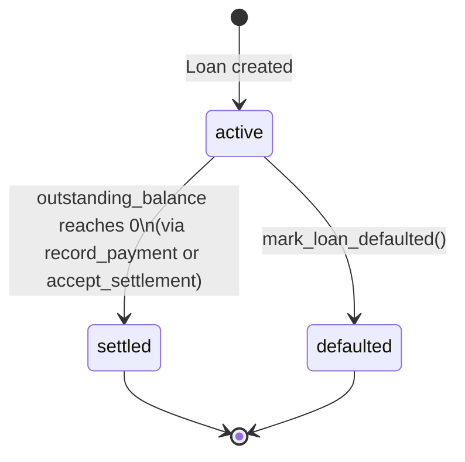
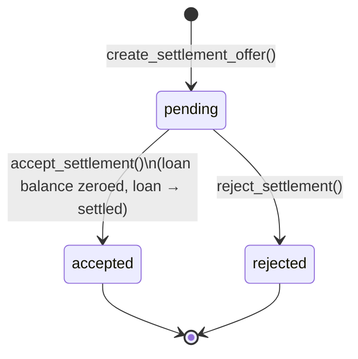
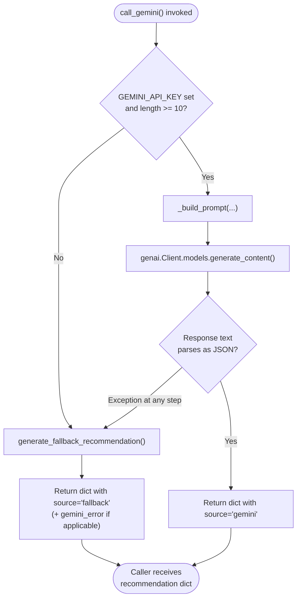

# System Design

## 1. Request Lifecycle Diagram

Generic lifecycle for any versioned API call (`/api/v1/...`):

## 2. Sequence Diagram — Scenario 1: AI-Powered Settlement Recommendation

This is the "real" versioned flow (`POST /api/v1/settlement/recommend`), as opposed to the simplified alias (`POST /api/settlement/predict`) described in [Troubleshooting.md](Troubleshooting.md).

## 3. Sequence Diagram — Scenario 2: Intelligent Negotiation Letter Generation

## 4. Sequence Diagram — Authentication (register / login)

## 5. Data Flow Diagram (Financial Analysis Engine)

## 6. State Diagram — Loan Lifecycle

Defined by `DataBase/loan_settlement_service.py` (business logic that is written but only partially wired to the API — see [Troubleshooting.md](Troubleshooting.md)).

## 7. State Diagram — Settlement Recommendation Lifecycle

## 8. Activity Diagram — Gemini Call with Fallback

